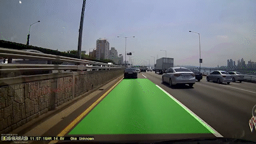
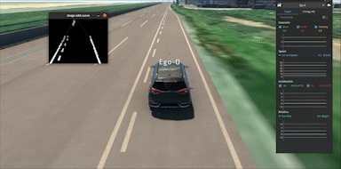
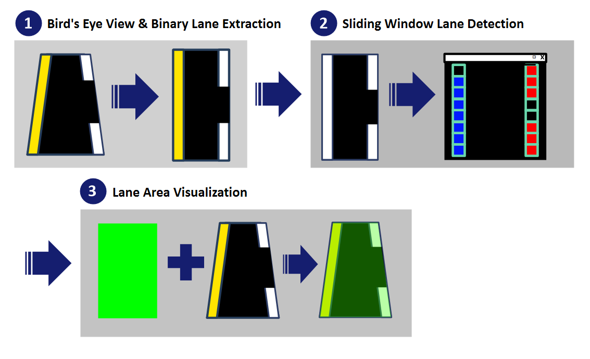
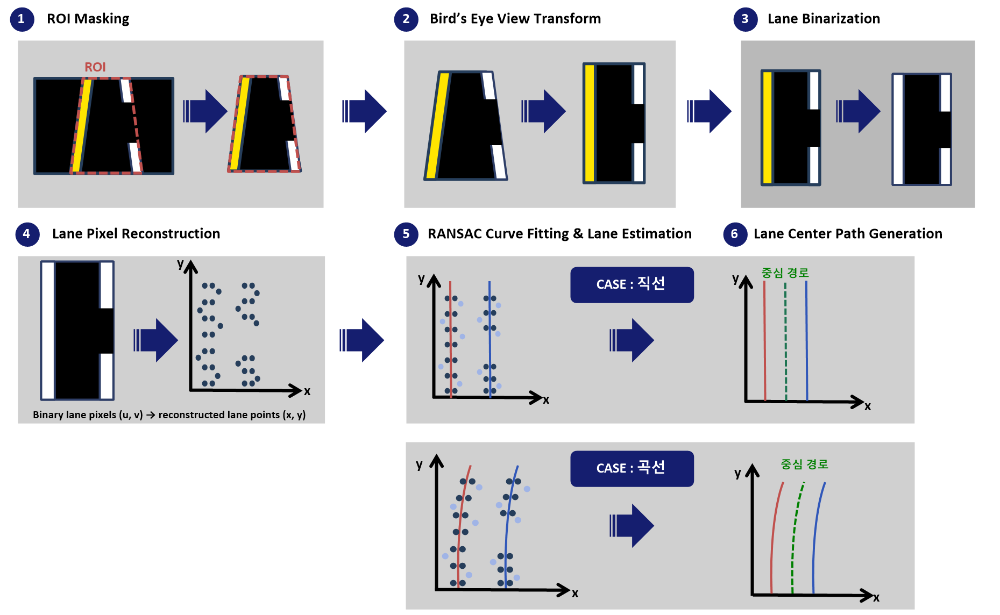

# Alpha Project 1: OpenCV-based Lane Detection

> OpenCV 기반 영상처리 기법을 학습하고, 차선 검출부터 Bird's Eye View 및 RANSAC 기반 곡선 차선 추정까지 단계적으로 구현한 프로젝트입니다.

<p align="left">
  
  
  
  
  
  
</p>


## 🎬 Demo

<table>
  <tr>
    <td align="center" width="50%">
      <b>Sliding Window Lane Detection</b><br><br>
      
    </td>
    <td align="center" width="50%">
      <b>MORAI + RANSAC Curve Fitting</b><br><br>
      
    </td>
  </tr>
</table>

## 📑 Overview

- [Demo](#-demo)
- [Introduction](#-introduction)
- [Key Features](#-key-features)
- [Pipeline](#-pipeline)
  - [1. Sliding Window Lane Detection](#1-sliding-window-lane-detection)
  - [2. MORAI + RANSAC Curve Fitting](#2-morai--ransac-curve-fitting)
- [Project Files](#-project-files)
- [Results](#-results)
- [Tech Stack](#-tech-stack)
- [Development Environment](#-development-environment)
- [How to Run](#-how-to-run)
- [What I Learned](#-what-i-learned)

---

## 🚀 Introduction

Alpha Project 1에서는 **전통적인 Computer Vision 기반 차선 인식**을 주제로 OpenCV의 기본 영상처리 기법부터 차선 검출 알고리즘까지 단계적으로 구현했습니다.

1학기에는 HSV 색 검출, Sliding Window, Filter & Edge Detection, ORB Feature Matching 등을 학습하고 구현했으며,  
하계 프로젝트에서는 **Perspective Transformation을 이용한 Bird's Eye View**와 **RANSAC 기반 Curve Fitting**을 적용하여 곡선 형태의 차선을 추정하도록 확장했습니다.

RANSAC 단계에서는 MORAI Simulator의 카메라 영상을 ROS Topic으로 수신하고, 차선 검출 결과를 ROS `Path` 메시지로 생성하는 구조까지 구성했습니다.

---

## 🔑 Key Features

- **Sliding Window 기반 차선 검출**
  - Binary Image에서 좌·우 차선 픽셀 탐색
  - Polynomial Fitting을 이용한 차선 곡선 추정
  - 검출된 차선 영역을 원본 영상에 시각화

- **Bird's Eye View**
  - Perspective Transformation을 이용한 Top View 변환
  - 원근 왜곡을 줄여 차선 구조 분석을 단순화

- **RANSAC 기반 Curve Fitting**
  - `scikit-learn`의 `RANSACRegressor` 활용
  - 다항식 Feature를 이용한 좌·우 차선 Curve Fitting
  - Outlier의 영향을 줄이고 안정적인 차선 모델 추정
  - 한쪽 차선 검출이 부족한 경우 기존 Lane Width를 이용해 보완

- **MORAI Simulator + ROS 연동**
  - `/image_jpeg/compressed` 카메라 Topic 구독
  - 검출된 좌·우 차선의 중앙을 ROS `Path` 메시지로 변환
  - `/lane_path` Topic으로 Publish

---

## 🛠 Pipeline

프로젝트에서는 차선 검출 방법을 단계적으로 발전시키며 두 가지 주요 파이프라인을 구현했습니다.

1. **Sliding Window 기반 차선 검출**
2. **MORAI Simulator + RANSAC Curve Fitting 기반 차선 추정**

---

### 1. Sliding Window Lane Detection

초기 차선 검출 단계에서는 도로 영상을 Bird's Eye View로 변환한 뒤, Binary Image에서 Sliding Window 방식으로 좌·우 차선을 추적했습니다.



#### Pipeline

```text
Bird's Eye View & Binary Lane Extraction
                  ↓
Sliding Window Lane Detection
                  ↓
Lane Area Visualization
```

#### ① Bird's Eye View & Binary Lane Extraction

Perspective Transformation을 이용해 도로 영상을 위에서 내려다본 형태의 **Bird's Eye View**로 변환합니다.  
이후 HLS Lightness Channel과 Threshold를 이용해 차선 영역을 Binary Image로 추출합니다.

```text
Camera Image
     ↓
Perspective Transform
     ↓
Bird's Eye View
     ↓
HLS Lightness Threshold
     ↓
Binary Lane Image
```

#### ② Sliding Window Lane Detection

Binary Image의 하단 Histogram을 이용해 좌·우 차선의 시작 위치를 찾고, 여러 개의 Window를 아래에서 위로 이동시키며 차선 Pixel을 탐색합니다.

탐색된 좌·우 차선 Point를 이용해 Polynomial Fitting을 수행하여 차선의 형태를 추정합니다.

```text
Binary Lane Image
        ↓
Histogram
        ↓
Left / Right Start Point
        ↓
Sliding Window Search
        ↓
Lane Pixel Collection
        ↓
Polynomial Fitting
```

#### ③ Lane Area Visualization

추정된 좌측 차선과 우측 차선 사이의 영역을 채운 뒤, Inverse Perspective Transform을 적용하여 원본 카메라 시점으로 복원합니다.

최종적으로 원본 영상 위에 검출된 주행 차선 영역을 Overlay하여 시각화합니다.

```text
Left / Right Lane
        ↓
Lane Area Fill
        ↓
Inverse Perspective Transform
        ↓
Original Image Overlay
```

---

### 2. MORAI + RANSAC Curve Fitting

하계 프로젝트에서는 MORAI Simulator와 ROS를 연동하고, 기존 Sliding Window 방식에서 확장하여 **Bird's Eye View + RANSAC Curve Fitting** 기반의 차선 추정 구조를 구현했습니다.

최종 RANSAC 구조는 **`lane_detection.py` + `util.py`**를 중심으로 동작합니다.



#### Pipeline

```text
MORAI Camera Image
        ↓
ROI Masking
        ↓
Bird's Eye View Transform
        ↓
Lane Binarization
        ↓
Lane Pixel Reconstruction
        ↓
RANSAC Curve Fitting & Lane Estimation
        ↓
Lane Center Path Generation
        ↓
/lane_path Publish
```

#### ① ROI Masking

MORAI Simulator의 `/image_jpeg/compressed` 카메라 영상을 수신한 뒤, 전체 영상에서 차선 검출에 필요한 도로 영역만 ROI로 설정합니다.

ROI 외부 영역을 제거하여 이후 영상처리 과정에서 불필요한 정보를 줄입니다.

#### ② Bird's Eye View Transform

`util.py`의 `BEVTransform`을 이용해 카메라 영상을 위에서 내려다보는 형태의 **Bird's Eye View**로 변환합니다.

원근 효과를 줄여 차선의 위치와 곡률을 보다 단순한 형태로 처리할 수 있도록 합니다.

#### ③ Lane Binarization

Bird's Eye View 영상에서 흰색 및 노란색 차선 영역을 분리하여 하나의 Binary Lane Mask를 생성합니다.

```text
BEV Image
    ↓
White Lane Mask
    +
Yellow Lane Mask
    ↓
Binary Lane Image
```

#### ④ Lane Pixel Reconstruction

Binary Image에서 차선에 해당하는 Pixel을 추출하고, 이미지 좌표 `(u, v)`를 Bird's Eye View 기준의 차선 좌표 `(x, y)`로 변환합니다.

```text
Binary lane pixels (u, v)
            ↓
Coordinate Reconstruction
            ↓
Reconstructed lane points (x, y)
```

이렇게 복원된 좌표는 이후 RANSAC Curve Fitting의 입력 Point로 사용됩니다.

#### ⑤ RANSAC Curve Fitting & Lane Estimation

`util.py`의 `CURVEFit` 클래스에서 `scikit-learn`의 `RANSACRegressor`를 이용하여 좌·우 차선을 각각 추정합니다.

차선 Point의 X 좌표를 Polynomial Feature로 변환한 뒤 RANSAC을 적용하여 Outlier의 영향을 줄이고 차선을 잘 설명하는 Curve를 추정합니다.

```text
Lane Points
    ↓
Polynomial Features
    ↓
Left / Right Point Selection
    ↓
RANSAC Curve Fitting
    ↓
Outlier Rejection
    ↓
Left / Right Lane Estimation
```

직선 구간뿐 아니라 곡선 구간에서도 동일한 구조로 좌·우 차선을 추정할 수 있도록 구성했습니다.

#### ⑥ Lane Center Path Generation

RANSAC으로 추정된 좌·우 차선의 중앙값을 계산하여 차량이 따라갈 **중심 경로**를 생성합니다.

```python
center_y = 0.5 * (y_pred_l + y_pred_r)
```

생성된 중심 경로는 ROS `Path` 메시지로 변환되어 `/lane_path` Topic으로 Publish됩니다.

```text
Left Lane     Right Lane
     \         /
      \       /
       Center Path
           ↓
      /lane_path
```

이를 통해 영상 기반 차선 검출 결과를 이후 차량 주행 제어 알고리즘에서 사용할 수 있는 경로 정보로 연결했습니다.

---


## 📁 Project Files

RANSAC 및 MORAI 차선 검출 관련 주요 파일은 다음과 같습니다.

| File | Description |
|---|---|
| `lane_detection.py` | **MORAI 기반 RANSAC 차선 검출 메인 ROS 노드** |
| `util.py` | `BEVTransform`, `CURVEFit`, Lane Path 생성 및 Pure Pursuit 관련 공통 모듈 |
| `morai_roi.py` | MORAI 카메라 영상에서 Mouse Callback으로 ROI 좌표를 확인하는 보조 노드 |
| `sliding_window_lane_detection.py` | Sliding Window + Polynomial Fitting 기반 초기 차선 검출 코드 |


---

## 📊 Results

프로젝트를 통해 다음 기능을 구현했습니다.

| Task | Result |
|---|---|
| HSV Color Detection | 특정 색상 영역 검출 |
| Sliding Window | 좌·우 차선 영역 추적 |
| Bird's Eye View | 도로 영상 Top View 변환 |
| RANSAC Line Fitting | 직접 구현한 RANSAC 기반 직선 차선 추정 실험 |
| RANSAC Curve Fitting | `RANSACRegressor` 기반 좌·우 곡선 차선 추정 |
| MORAI Camera | ROS CompressedImage 기반 카메라 영상 수신 |
| Lane Path | 좌·우 차선 중앙 경로를 `/lane_path`로 Publish |
| Edge Detection | 다양한 Edge Filter 비교 |
| Feature Matching | ORB 기반 특징점 매칭 |

특히 하계 프로젝트에서는 기존 차선 검출을 **MORAI Simulator + Bird's Eye View + RANSAC Curve Fitting** 구조로 확장하고, 검출 결과를 ROS Path로 연결하는 과정을 구현했습니다.

---

## 💻 Tech Stack

| Category | Technology |
|---|---|
| Language | Python 3 |
| Computer Vision | OpenCV |
| Numerical Computing | NumPy |
| Robust Regression | scikit-learn `RANSACRegressor` |
| Robot Middleware | ROS1 (`rospy`) |
| Simulator | MORAI Simulator |
| ROS Messages | `sensor_msgs`, `nav_msgs`, `geometry_msgs`, `morai_msgs` |

---

## ⚙️ Development Environment

본 프로젝트는 **ROS1 기반 레거시 환경**을 기준으로 작성되었습니다.

| Environment | Version |
|---|---|
| Ubuntu | 20.04 |
| ROS | Noetic |
| Python | 3.8.x |
| NumPy | 1.19.5 |
| OpenCV | 4.5.x |
| scikit-learn | 0.24.2 |

```bash
pip3 install numpy==1.19.5 opencv-python==4.5.5.64 scikit-learn==0.24.2
```

> 일부 코드에서 `np.int` 및 구버전 `RANSACRegressor` API를 사용하므로 최신 라이브러리에서는 호환성 문제가 발생할 수 있습니다.

---


## ▶️ How to Run

### 1. Sliding Window Lane Detection

`sliding_window_lane_detection.py`와 `xycar_track1.mp4`를 같은 폴더에 둔 뒤 실행합니다.

```bash
python3 src/sliding_window_lane_detection.py
```

> 저장된 코드의 `cv2.waitKey(0)`을 `cv2.waitKey(1)`로 변경하면 영상을 연속 재생할 수 있습니다.

### 2. MORAI + RANSAC Lane Detection

MORAI Simulator와 ROS1이 실행 중이고 `/image_jpeg/compressed` Topic이 수신되는 상태에서 실행합니다.

```bash
roscore
source ~/catkin_ws/devel/setup.bash
rosrun beginner_tutorials lane_detection.py
```

실행 전 아래 항목이 설정되어 있어야 합니다.

- `sensor/sensor_params.json`
- White / Yellow Lane HSV Range
- ROI 4 Point 좌표

검출된 차선 중심 경로는 `/lane_path` Topic으로 Publish됩니다.

```bash
rostopic echo /lane_path
```

---


## 📚 What I Learned

- OpenCV를 이용한 기본 Image Processing Pipeline 구성
- HSV / Threshold / Edge Detection의 차이와 활용 방법
- Perspective Transformation과 Homography의 원리
- Sliding Window 기반 차선 픽셀 탐색
- RANSAC을 이용한 Outlier Robust Line / Curve Estimation
- `scikit-learn RANSACRegressor`를 이용한 다항 차선 Curve Fitting
- MORAI Simulator 카메라 영상의 ROS Topic 처리
- Bird's Eye View 좌표와 영상 좌표 사이의 변환
- 좌·우 차선 중앙을 ROS `Path` 메시지로 생성하는 과정
- 영상처리 결과를 차량 주행 시스템에서 사용할 수 있는 경로 정보로 연결하는 구조
- ORB Descriptor와 Feature Matching 구조
